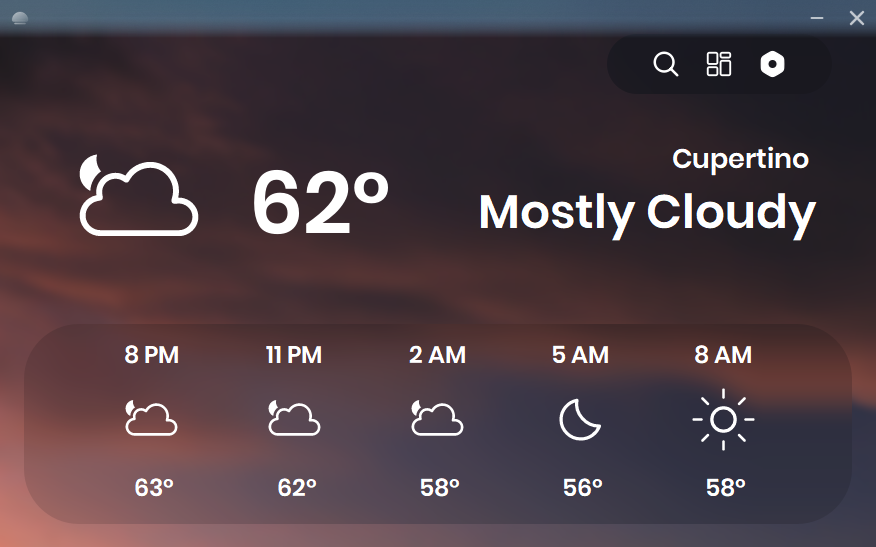

# Skyline - Weather made simple.

Skyline is a simple and abstract desktop weather app meant for checking the weather quickly and in a beautiful way!

## Features

- Current temperature, conditions, feels-like temperature, humidity, dew point, UV index, air quality, sunrise, and sunset.
- Hourly and 5-6 day forecasts with precipitation and wind information.
- Animated rain and snow effects that match the current weather.
- Search for locations and switch between them!
- A dashboard for saving and reordering up to five locations.
- Light and dark themes, plus metric/imperial unit preferences.
- Interactive weather map with precipitation, cloud, temperature, and wind layers.

## Requirements

- Windows 10/11 computer ig.

## Installation

1. Open the repository's **Releases** page.

2. Download `SkylineSetup.exe` from the latest release.

3. Install it lol.

### Check another location

Use the search button in the app, enter a place and it'll show the weather there.

### Dashboard

Lets the user remember upto 5 locations. Has re-arranging capabities too!

### Change units or theme

Open Settings to change several minor features and a theme.

### Weather map

A weather map that shows 4 different weather layers.

## Notes

- The insights may not work due to API problems.
